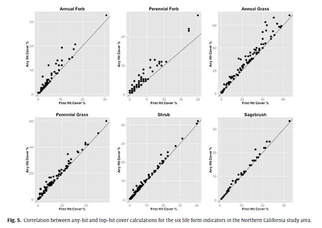

## ggplot assignment
For this assignment, we'll be working with a dataset that compared different ways to calculate cover indicators from line-point intercept data. You can calculate cover using all the LPI "hits" or intercepts from any canopy level (the correct way) or using just the first hit (an abomination that never should have been unleashed into the world!). In short, we're going to try to replicate this graph (but for only 4 of the indicators):

I've put a CSV file with the data in it into this directory, and have started a R script for you that loads the data and tidies it up for plotting. The assignment is to use __ggplot__ to create this graph for the 4 indicators in the CSV file.

Some tips:
- Put first hit cover on the X axis and any hit cover on the Y axis.
- Make sure the axis labels are pretty and give the graph a nice title (hint: use __labs()__)
- Add the 1:1 line (__geom_abline()__).
- In addition to the graph from the publication, add the regression trend line (__geom_smooth()__) for each plot. _BONUS if you can figure out how to add the R^2 value to each plot!_
- You'll want to use one of ggplots faceting functions to split the graphs out by indicator.
- Use __ggsave()__ to save your graph as a .jpg or .png file.

Push your R script and your graph up to the class github repo.

Let me know if you have any questions!

J
