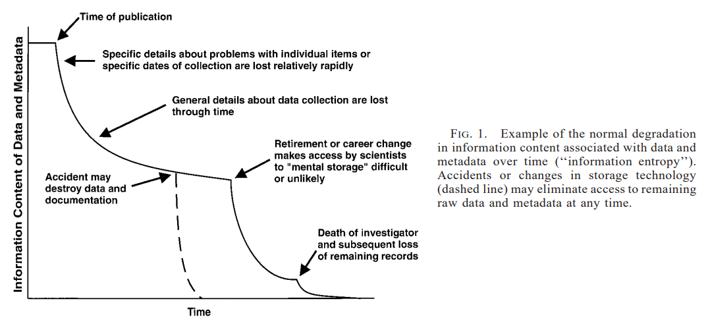
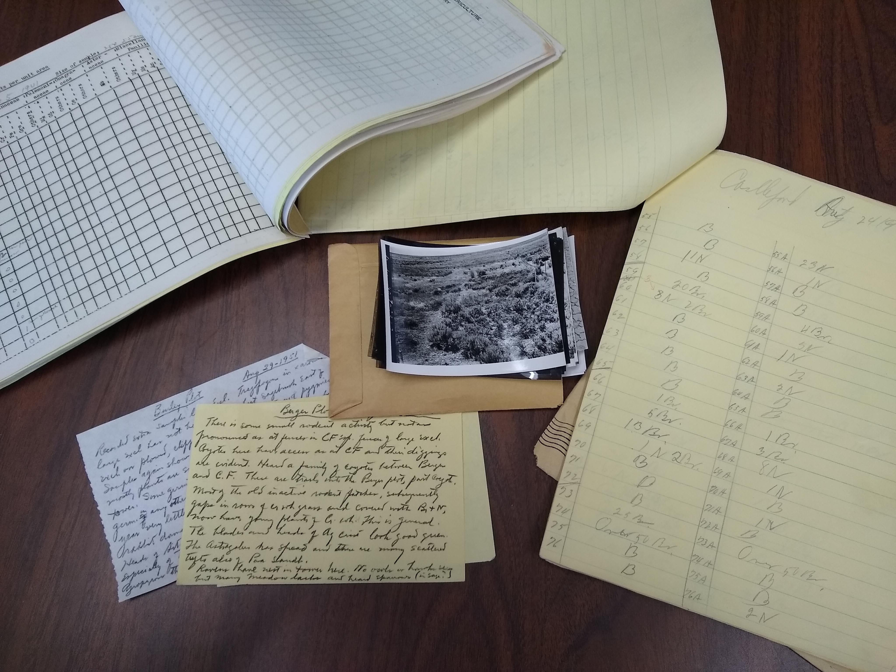
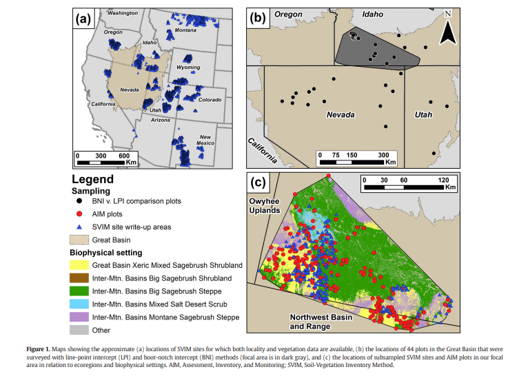
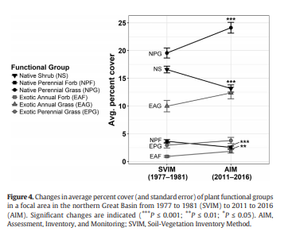
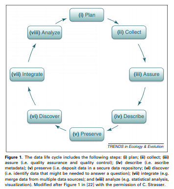
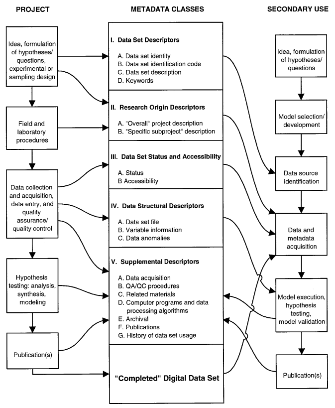

It's all well and good to collect an amazing dataset, do some elegant analyses, and write a killer paper, but a some point you're going to want to (or need to) share your data with the larger world. Increasingly funders and publishers are requiring researchers to make their data and code available as part of the publishing process. In the future someone might want to pick up your dataset and either fold it into a new study or revisit your sites for some additional data. For this to work, though, there are a few prerequisites: 1) the data have to be accessible to folks, and 2) they have to be described well enough for people to know what you did and what your data mean.

## Data Entropy
The challenge is that the "information content" in a dataset - meaning the details that we know about what the data are and how they were collected starts to degrade almost at the point when they're collected. Michener et al. (1997) called this "data entropy".

Consider a couple of examples.
1. The Rangeland Center interns unearthed a box of field and aerial photographs, datasheets, and notes for a project conducted in southern Idaho from 1934-1937. There are literally hundreds of photographs and thousands of datasheets documenting range conditions from almost 100 years ago. This is potentially a very valuable dataset, but there's very little documentation of what the study was for, how the data were collected, or even where the study sites are. The ability to reuse these data are fairly limited without that information.

2. In the early 1980's, the BLM initiated a national rangeland monitoring program called Soil-Vegetation Information and Monitoring (SVIM). Data were collected at thousands of sites using what were then state-of-the-art field methods (step-point-intercept) from 1977-1983. For political reasons (i.e., fear of loss of grazing rights if the data were not flattering), the program was killed in 1983. The state of Nevada actually physically destroyed all of their datasheets. The remaining data was filed in cabinets and drawers. Researchers from USGS in Boise discovered a bunch of the SVIM data in the course of digitizing records for the Land Treatment Digital Library in the mid 2010's. They invested an amazing amount of effort to digitize the SVIM data and georeference the field sites as best they could. This represents an amazing dataset that can be combined with modern monitoring efforts. However, the depth of these comparisons is limited because much of the information on the sampling design for the SVIM data was lost. (images from Barker et al. (2018)).

## The Data Lifecycle
Michener and Jones (2012) decribed what they termed the Data Life Cycle as an attempt to get researchers to think about data as an integral part of all aspects of research, not just something related to methods and results. By paying attention to these stages and how they interact with general project development, you get data that can best meet the needs of your project and potentially be useful for other research.

## Metadata
Both of these examples argue strongly for creating good metadata. Simply put, metadata is the data that describes your data. It can be basic or very formalized depending on how you are going to store and distribute your data. At the minimum, it should describe:
 - What the data are,
 - Why they were collected,
 - How the data were collected,
 - Who collected the data and who to contact for access or questions,
 - What kinds of access or use constraints are in place,
 - What the data values mean (i.e., a detailed description of each attribute).

 Michener et al. (1997) proposed the following set of basic elements to ecological metadata:

 

 This is a useful diagram because it highlights two things. First, you should be collecting the pieces of your metadata throughout the course of your project (i.e., if you wait until the end, it's very painful - speaking from experience here). Second, the metadata promote the reuse of data (by you and others).

 ### Tools for metadata
 Most researchers working on their own or in small teams prefer to develop their own system for keeping their metadata locally and then fit it into a more formal scheme or tool when it's time to publish or archive their data. There are several tools for formally documenting metadata.
  - Ecological Metadata Language is a schema for documenting ecological data and is used by several data repositories like DataOne and Dryad.
  - Morpho is a metadata editing tool produced by DataOne.
  - Most data repositories have their own online metadata editors that they'll require when you submit your data.

## Data Archives
Data archives (or repositories) are public websites where you can deposit datasets so that others can access them. These are called archives because, in theory, they'll be around forever (or at least for a really long time). Archives also have the advantage that they give you a citable version of your data and usually also issue a DOI number for the dataset (which can give a convenient, stable link to the data). Through a data archive you can also set the access controls and licensing of your data. Why use a data repository rather than hosting the data yourself (either on your website or via GitHub)? Mostly because the archive will handle the accessibility part for you.

There are lots of data archiving sites. Some common data archives are:
 - DataOne
 - Dryad
 - Pangea.de - mostly for earth-science topics
 - Open Science Foundation
 - Mendeley data - because Elsevier is the Google of publishing
 - USGS ScienceBase
 - Figshare - mostly for results (presentations, figures, etc.), but increasingly for data too.

## Readings
  Barker, Brittany S., David S. Pilliod, Justin L. Welty, Robert S. Arkle, Michael G. “Sherm” Karl, and Gordon R. Toevs. “An Introduction and Practical Guide to Use of the Soil-Vegetation Inventory Method (SVIM) Data.” Rangeland Ecology & Management 71, no. 6 (November 2018): 671–80. https://doi.org/10.1016/j.rama.2018.06.003.

  Michener, William K., and Matthew B. Jones. “Ecoinformatics: Supporting Ecology as a Data-Intensive Science.” Trends in Ecology & Evolution 27, no. 2 (February 2012): 85–93. https://doi.org/10.1016/j.tree.2011.11.016.

  Kervin, Karina, William Michener, and Robert Cook. “Common Errors in Ecological Data Sharing.” Journal of EScience Librarianship 2, no. 2 (2013). https://doi.org/10.7191/jeslib.2013.1024.

  Michener, W. K. “Meta-Information Concepts for Ecological Data Management.” Ecological Informatics 1 (2006): 3–7.

  Michener, W. K., J. W. Brunt, J. J. Helly, T. B. Kirchner, and S. G. Stafford. “Nongeospatial Metadata for the Ecological Sciences.” Ecological Applications 7 (1997): 330–42.

  Peters, D. P. C. “Accessible Ecology: Synthesis of the Long, Deep, and Broad.” TREE 25 (2010): 592–601.

  Peters, D. P. C., P.M. Groffman, K.J. Nadelhoffer, N.B. Grimm, S.L. Collins, W.K. Michener, and M.A. Huston. “Living in an Increasingly Connected World: A Framework for Continental-Scale Environmental Science.” Frontiers of Ecology and the Environment 6 (2008): 229–37.
